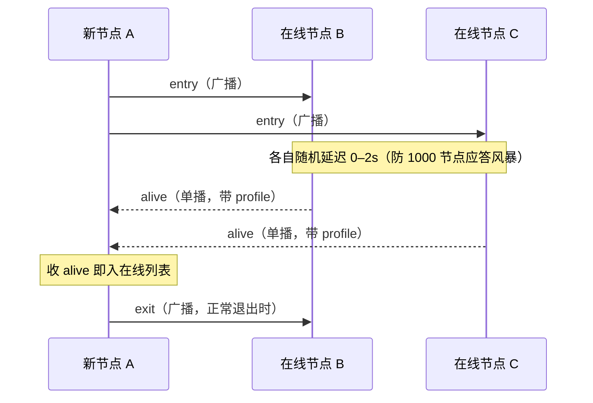
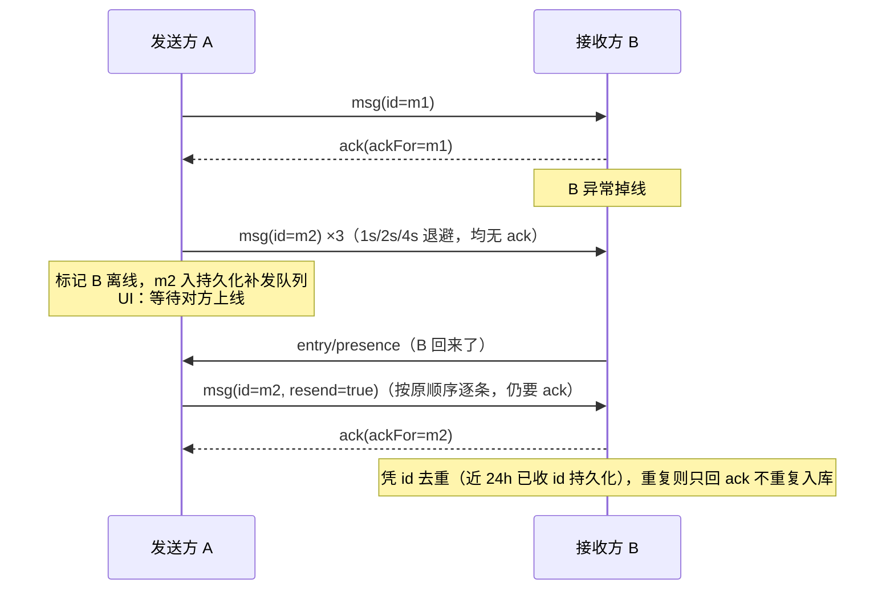
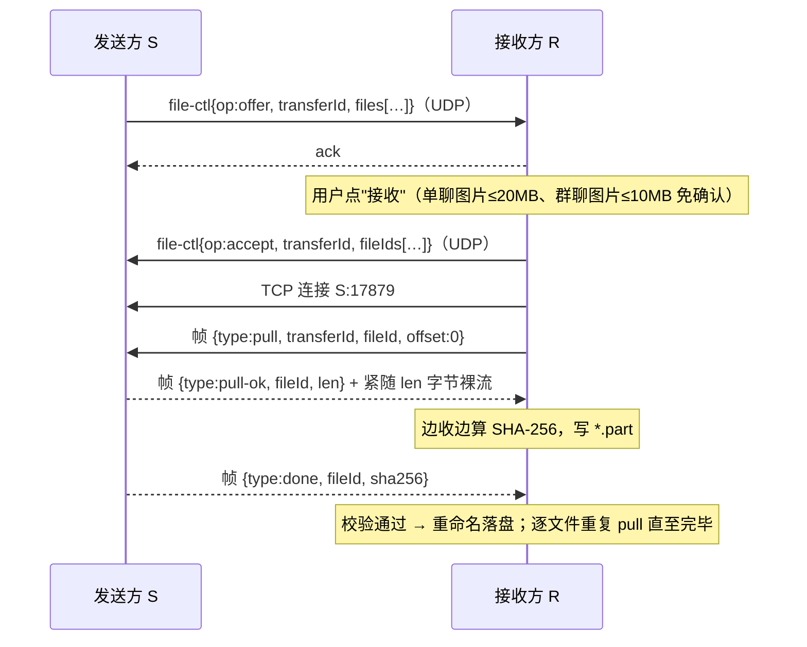

# 茶话间（Teahouse）协议设计文档

| | |
|---|---|
| 状态 | v0.34，P1 协议基线已落地；自更新拉包请求携带可选运行架构 |
| 日期 | 2026-06-28 |
| 关系 | 本文是**线上协议的唯一事实来源**；功能取舍依据 [requirements.md](requirements.md)（决议 #5：借鉴 ipmsg/iptux 机制、报文自有、不互通、不加密） |

## 1. 设计原则

1. **机制照搬成熟做法**：UDP 广播发现、UDP+ACK 可靠消息、TCP 拉取式文件传输——与 ipmsg/iptux 同构，实现时可对照 `references/ipmsg/protocol.txt` 与 `references/iptux/src`。
2. **报文自有**：UTF-8 JSON，永不引入 GBK/SJIS；不与 IPMSG 线上互通。
3. **对等无服务器**：任何节点崩溃/离线不影响其余节点；协议必须容忍丢包、乱序、重复、节点随时消失。
4. **可演进**：信封带版本号；收到未知 `type` 或未知字段一律忽略不报错（向前兼容的基础）。
5. **内网信任模型**：不加密、不签名（决议 #5），但**所有入站报文按不可信输入做校验**（长度、类型、字段白名单）。
6. v1 仅 IPv4，IPv6 远期（决议 #3）。

## 2. 传输层总览

| 通道 | 传输 | 默认端口 | 承载 |
|---|---|---|---|
| 控制/消息 | UDP（广播 + 单播） | 17878 | 发现、心跳、资料、gossip、短消息、ACK、文件控制 |
| 数据 | TCP | 17879 | 文件/图片字节流、长消息、批量补发 |

- UDP 单包载荷上限 **1200 字节**（避免 IP 分片）；装不下的内容一律走 TCP。
- 两个端口默认值已拍板（决议 #6），可在设置中修改，全网节点须一致。
- 多网卡：默认向**所有非回环 IPv4 接口**发广播、全接口监听；设置中可绑定指定网卡（虚拟网卡多的办公机需要，决议 #4）。

## 3. 节点标识与资料

- **nodeId**：首次启动 `crypto.randomUUID()` 生成，本地持久化。昵称、IP、主机名怎么变，**身份和会话历史都跟着 nodeId 走**。
- 同机多实例：v1 不支持（端口独占即天然互斥）。
- 节点资料（profile）结构，随 `entry` / `alive` / `profile` 报文携带：

```jsonc
{
  "nodeId":  "0d1f…",          // UUID
  "nick":    "张三",            // ≤ 32 字符
  "company": "某某科技",        // ≤ 32 字符，可空 → 通讯录归"未分组"
  "dept":    "研发部",          // ≤ 32 字符，可空
  "team":    "后端组",          // ≤ 32 字符，可空（公司 ▸ 部门 ▸ 团队 三级）
  "avatar":  3,                 // 头像模板编号；-1=昵称色块；>=0 为 背景色下标*20+emoji下标
  "profileRev": 7,              // 资料版本号，每次修改 +1；心跳携带，用于失配刷新
  "ver":     "0.1.0",           // 应用版本；"发现内网更高版本时提示"的依据（P2）
  "host":    "zhangsan-PC",
  "platform":"win|mac|linux",
  "tcpPort": 17879,
  "caps":    ["grp1","img1"]    // 能力声明，供未来扩展探测
}
```

**caps 能力位**（短串，入站按 `LIMITS.capItem` 截断、未知位忽略）：`grp1` 群聊、`img1` 图片消息、**`fd1` 私聊文件直接发送**（决议 #174，支持接收 `file-ctl {op:"direct"}` 并按本地策略自动 accept）、**`upd1` 可作为本平台更新源**（决议 #166/#170/#181）——声明者运行于可分发形态（Windows nsis 安装版可自留安装器、Linux deb 可经 `dpkg-deb` 自重打包），且本机已有可提供的本平台安装包，能向同平台、同架构、版本更低的节点提供安装包；形态不可分发 / 尚未备妥包时不声明。绿色版（portable / AppImage）机制上同样适用，本期实现聚焦 nsis / deb。

## 4. 报文信封（UDP 与 TCP 控制帧通用）

```jsonc
{
  "v":    1,            // 协议版本，整数
  "type": "msg",        // 报文类型，见 §5
  "id":   "uuid",       // 本报文唯一 ID（去重、ACK 引用的对象）
  "from": "nodeId",
  "ts":   1780000000000, // 发送方 unix 毫秒
  "payload": { }
}
```

兼容规则：`v` 相同主版本必须互通；未知 `type`/未知字段忽略；缺必填字段的报文丢弃并计数（不回错误，防放大）。

## 5. 报文类型一览

| type | 方向 | 通道 | 用途 |
|---|---|---|---|
| `entry` | 广播/单播 | UDP | 上线宣告（带 profile） |
| `alive` | 单播 | UDP | 对 `entry` 的应答（带 profile，随机延迟 0–2s 防风暴） |
| `exit` | 广播 | UDP | 正常下线 |
| `presence` | 广播 + 对跨网段已知节点单播 | UDP | 心跳 `{seq, profileRev}` |
| `profile` | 广播/单播 | UDP | 资料变更（昵称/公司/团队/头像） |
| `peers` | 单播 | UDP | gossip：已知节点摘要交换 |
| `scan-ranges` | 单播 | UDP | 低频同步扫描 CIDR 记录（不触发即时扫描） |
| `msg` | 单播 | UDP/TCP | 用户消息（kind 细分，见 §7） |
| `ack` | 单播 | UDP/TCP | `{ackFor: id}`，对 `msg` 与 `file-ctl` 的确认 |
| `file-ctl` | 单播 | UDP | 文件控制：offer / accept / decline / cancel / direct（`direct` 为发送方在私聊文件卡片上请求直接发送；`offer.purpose:"update"` 为自更新包，见 §8） |
| `update` | 单播 | UDP/TCP | 局域网自更新：可靠控制报文；`req` 请求对端发来其平台安装包（决议 #166/#170，见 §8） |
| `group` | 单播 | UDP | 群元数据：info / need（见 §7.4） |

## 6. 发现、在线与跨网段

### 6.1 上线 / 应答 / 下线（对应 IPMSG 的 BR_ENTRY / ANSENTRY / BR_EXIT）



**批量开机风暴对策**（统一 VM 环境集中开机是常态，决议 #22）：① 应答抖动窗口按已知在线规模自适应——在线 <100 用 0–2s，每多 100 在线扩 1s，上限 0–8s；② 对 10s 内已互发过 `entry`/`alive` 的节点不重复应答；③ 入站 `entry` 处理排队削峰，处理不过来时丢弃靠 `presence` 周期自愈。

**源地址连续性**（决议 #132）：`entry` / `alive` / `profile` 的 `profile.nodeId` 必须等于信封 `from`，否则丢弃；已在线节点的 nodeId 只接受当前记录的 IP+UDP 端口来源，来自不同 UDP 源地址的同 nodeId 报文不更新资料、不改绑地址。离线历史节点换地址必须重新携带完整 profile 完成 `entry`/`alive` 握手后才可更新。

### 6.2 心跳与离线判定（IPMSG 没有，我们补上）

- 每 **30s** 广播一次 `presence`；对**不在本网段**的已知在线节点，同周期批量单播（限速）。
- `presence` 携带 `profileRev`（资料版本号）：收端发现与本地缓存版本不一致 → 单播 `entry`，对方按 §6.1 回 `alive`（带全量资料）即完成刷新。零新增报文类型，最迟一个心跳周期内纠正"机器没换、用的人换了"的资料漂移（需求 F-DISC-7）。
- **90s**（3 个周期）收不到某节点任何报文 → 标记离线。
- **按需探活（在线二次校验）**：打开与某节点的会话时，立即向其单播 `entry`（对方回 `alive`），约 **2s** 未应答即在 UI 转为离线——弥补 90s 心跳窗口期的"假在线"，防止对着掉线的人发消息（需求 F-DISC-8，决议 #16）。
- 消息连续重传失败（§7.2）→ 立即标记离线并转入补发队列，不等心跳超时。
- 手动"刷新列表" = 重新走一遍 6.1 + 6.3。

### 6.3 跨网段发现（三板斧，对应需求 F-DISC-2）

1. **手动节点**：对用户填的 IP / 导入列表逐个单播 `entry`，收到 `alive` 即建立联系。
2. **网段扫描**：对配置的 CIDR（如 `10.1.0.0/24`）限速单播 `entry`（≤ 128 地址/秒），无应答地址不重试（手动触发才扫）。
3. **gossip 散播**：**结识即交换**（首次得知某节点在线时，把自己已知的在线节点摘要单播给它）+ 每 5 分钟向随机 2 个在线节点周期交换，报文为 `peers`：

```jsonc
{ "peers": [ { "nodeId": "…", "ip": "10.2.0.8", "tcpPort": 17879, "lastSeen": 1780000000000 } ] }
```

   收到 `peers` 后，对**陌生且 lastSeen < 10 分钟**的条目单播 `entry` 验证，**收到 `alive` 才入列表**（不直接信任转述，防列表投毒）。跨网段只要存在一个双网段可达的"桥"节点，全网即可打通——内网通同思路。`peers` 超出 UDP 载荷时拆多条发送（同 §8 offer 的拆包约定）。

- **节点缓存**：已知节点（nodeId, ip, tcpPort, lastSeen）持久化；启动时除广播外，对缓存中 7 天内活跃的节点单播 `entry`，加速跨网段在线列表重建。

### 6.4 扫描范围低频分享（决议 #114）

网段范围分享只同步“配置候选”，不代表收端马上扫描。新增报文 `scan-ranges`，由已在线节点间单播低频交换：

```jsonc
{ "ranges": [ { "cidr": "10.1.2.0/24", "addedAt": 1780000000000 } ] }
```

- 出站：启动后随机延迟 2–10 分钟分享一次，之后每 60 分钟兜底分享；本机手动新增扫描网段后只安排一次抖动分享，不立即群发。
- 入站校验：只接受合法 IPv4 CIDR，且展开主机数不得超过 1024（最大 /22）；每包最多 10 个网段；未知字段忽略。
- 合并：收端只新增本机没有、且未被用户忽略的网段记录，并保存来源 nodeId / 显示名 / addedAt；远端不能删除、覆盖或修改本机已有记录。
- 扫描：收到新网段后进入本机后台扫描队列，首次随机延迟 30–90 分钟；同一自动同步网段最短 12 小时扫一次；在线节点数超过 50 时，按 `(self nodeId + cidr)` 的稳定 hash 抽样，默认约 10% 节点参与扫描，其他节点继续依赖 `peers` gossip 学到结果。
- 手动扫描：用户在设置页点击“扫描/再次扫描”仍按 §6.3 的手动路径立即限速扫描，不受后台队列节流影响。
- 忽略：用户删除同步来的网段后，本机写入忽略表；后续再次收到相同 CIDR 不自动加回。用户自己手动新增相同 CIDR 时清除忽略。

## 7. 消息通道

### 7.1 消息报文

`msg.payload`：

```jsonc
{
  "kind": "text",        // text | group-text | recall | nudge | pk
  "text": "你好",         // kind=text/group-text；UTF-8，UDP 装不下走 TCP
  "groupId": "uuid",     // 仅 group-text / 群聊 pk
  "groupRev": 4,         // 仅 group-text / 群聊 pk，群元数据版本（见 §7.4）
  "mentions": ["nodeA"], // 仅 group-text 可选：被 @ 的成员 nodeId 列表
  "targetId": "uuid",    // 仅 recall：要撤回的原消息 id
  "game": "dice",        // 仅 pk：dice | rps
  "result": 6,           // 仅 pk：dice=1..6；rps=rock|paper|scissors
  "resend": true         // 文本 / 群文本 / 撤回补发标记（可选）；ts 保持原值；nudge/pk 不使用
}
```

- 文本 ≤ **800 字节**优先走 UDP，超过经 TCP 控制帧发送（同信封）。短文本若 UDP 三次退避仍无 `ack`，发送端可复用同一 TCP 控制帧兜底一次；TCP 仍失败才按离线补发处理（决议 #46）。
- 撤回：自己的文本 / 群文本 / PK 消息在 **5 分钟内**可发 `msg(kind:"recall", targetId)`（决议 #63/#139，原 2 分钟）；群聊撤回额外携带 `groupId` / `groupRev`。收端仅接受"撤回者 = 原消息发送者"且会话匹配的指令，随后本地隐藏原消息并插入系统提示行（如"对方撤回了一条消息"）。撤回 PK 只隐藏目标 PK 消息，不级联影响之后别人另发的 PK。撤回指令与普通消息一样走 ACK / 重传 / 离线补发；若与原消息乱序到达，收端短暂挂起撤回，待原消息入库后应用。图片/文件/表情由 `file-ctl` 生成本地消息，两端消息 id 暂不一致，撤回留后续扩展。
- 私聊窗口震动：`msg(kind:"nudge")` 仅单聊使用，payload 除 `kind` 外不带正文、群字段或文件引用；它是可靠即时提醒动作。发送走可靠 ACK；若对端无响应则失败且**不进入离线补发队列**。发送成功后发送端写入本地 `system` 提示行；收端未限流时写入本地 `system` 提示行、唤起主窗并定位到 `single:<from>` 会话；若该单聊免打扰，收端不得唤起、置前或震动主窗。这些提示行不写 FTS，不改变线上载荷。收发两端均按同一对端限流：60 秒最多 2 次，且任意两次至少间隔 15 秒；收端超限时仍回 ACK，但丢弃本地震动动作与提示，防止重传放大骚扰（决议 #109/#110/#112）。
- PK 分歧解决：`msg(kind:"pk")` 用于骰子与猜拳（决议 #139）。`game` 取 `dice` 或 `rps`；`dice.result` 为整数 1–6，`rps.result` 为 `rock|paper|scissors`。每条 PK 都是独立消息，不使用回合关联字段，对方点击参与时也发送新的独立 `pk` 消息。结果由发送端主进程在发送瞬间生成并写入载荷；接收端不得重新随机，只播放本地动画并定格到载荷结果。PK 是在线即时娱乐：单聊只在对端在线时发送，群聊只向当时在线的其他成员逐个单播，不进入离线补发队列，payload 也不带 `resend`；发送失败后的重试必须复用同一 `msgId` 与同一 `result`，不得重新随机。通知 / 会话预览 / 历史搜索不得从线上摘要提前暴露结果；旧版本客户端不发送 fallback 文本，混用时按不支持 PK 处理。PK 不提供承诺揭示、签名或加密公平性证明。
- 群内 @：`group-text.mentions` 为可选 nodeId 数组，最多 50 个；收端若包含本机 nodeId，则会话列表本地标记"有人@我"，打开会话后清除。`mentions` 只影响提醒，不影响投递范围；投递仍按群成员列表逐个单播。
- 图片消息：线上即一次 `file-ctl` 传输，offer 携带 `purpose:"image"` 标记（单聊单文件 ≤20MB；群聊单文件 ≤10MB），收端**免确认**自动拉取进图片缓存，两端本地各自生成 `kind:"image"` 的消息记录；超限或多文件退化为普通文件流程（群聊超 10MB 图片必须由接收者手动接收后才开始 TCP 拉取，决议 #33）。不另发 msg 报文——单一事实源，避免双报文乱序协调。群聊图片同样不新增 `msg(kind:"image")`，而是在逐成员 offer 中携带 `groupId/groupRev` 作为群会话上下文。
- `file-ctl offer` 接收侧必须以所有非目录文件的 `size` 重新求和，且该值必须等于 offer 声明的 `totalSize`；图片/表情免确认阈值也以接收侧复核后的总大小为准（决议 #132）。
- 表情包消息（`kind:"sticker"`）：复用图片通道且**一律免确认**——发送端收藏入库时已压缩（静图 ≤512px WebP / GIF ≤2MB，见 ui-design.md §5），体积天然受控；收端进表情缓存，气泡内固定小尺寸渲染（需求 F-MSG-7）。

### 7.2 可靠投递、去重与离线补发



- 重传：1s / 2s / 4s 三次退避；短消息仍无 `ack` 时先尝试 TCP 控制帧兜底一次，仍失败 → 入队 + 标离线。
- UDP `ack` 只在来自本轮实际发送目标 IP+UDP 端口时才确认等待表；重试每轮重新读取节点表目标地址，避免同 nodeId 的其他 UDP 源伪造 ACK（决议 #132）。
- 补发触发：收到目标节点任意 `entry` / `alive` / `presence`。队列保留 7 天、单节点 200 条（决议 #6）。
- 去重窗口：已收 `id` 持久化保留 24h（覆盖补发与重启场景），命中只回 `ack` 不入库。
- 会话内排序：按 `ts` + 收到顺序；补发消息沿用原 `ts`，落在历史正确位置。

### 7.3 多选群发（已停用，决议 #62）

UI 概念，协议上不存在：对每个收件人各发一条独立 `msg`，各自走单聊上下文（决议 #3）。**v0.5.26 起取消该 UI 入口**（改用讨论组）；因协议本就无群发报文，停用不影响协议层。

### 7.4 讨论组（群聊）

- 群元数据：`{groupId, name, members[nodeId…], rev, updatedBy, updatedTs, creatorIp, creatorId, adminSecretHash, adminHint}`，**rev 单调递增，冲突按 (rev, updatedTs) 取大者**（LWW，尽力而为一致性，需求 F-MSG-4）。`creatorId` 为创建者 nodeId，v0.16.3 起随 `group.info` 发送；旧版本缺该字段时接收方按兼容规则从无密码群的 `updatedBy` 回填。
- 群文本 = 向 members 逐个单播 `msg(kind:"group-text", groupId, groupRev)`，离线成员走 §7.2 补发。群 PK = 向当前在线 members 逐个单播 `msg(kind:"pk", groupId, groupRev)`，离线成员不入队、不补发。
- 群图片/文件 = 向在线 members 逐个单播 `file-ctl{op:"offer", groupId, groupRev}`，每个收件人一条独立 transfer；离线成员不入队（决议 #4/#32）。发送端本地只插一条群消息，`fileRef.transferIds[]` 汇总各成员 transfer；收端按 `groupId` 插入群会话，若不认识该 groupId 或 rev 落后，复用 `group{op:"need"}` 向发送者索要元数据。群图片只有单图 ≤10MB 时允许携带 `purpose:"image"`，超限图片不带 purpose，按普通文件卡片展示与手动接收（决议 #33）。
- 收端不认识该 groupId 或本地 rev 落后 → 向发送者发 `group{op:"need", groupId}`，对方回 `group{op:"info", …全量元数据}`。
- 成员增删 = 修改元数据（rev+1）后向**新旧成员全集**发 `group{op:"info"}`（被移出者借此得知）。
- 上限 50 人/组；群管理指改名、添加成员、移出他人。建群时记录 `creatorIp` 与 `creatorId`，并可选管理密码：有密码的组同步 `adminSecretHash`（密码明文不入库、不入协议）与 `adminHint`（可空提示文案，供成员输入密码时展示），成员输入密码后可发起管理变更；无密码的组允许创建者管理，校验优先使用创建者 nodeId，保留创建 IP 作为旧版本兼容。成员自行退组不需要管理权限。
- 收端合并远端 `group.info` 前先校验管理来源：本地已有该组且 `adminSecretHash` 非空时，远端元数据必须携带相同摘要；本地已有该组且无管理密码时，远端来源 IP 等于本地 `creatorIp` 可接受，或信封 `from` 等于本地 `creatorId` 且远端 `updatedBy` 也等于该创建者可接受。仅移除 `updatedBy` 自己的退组变更可例外接受。该 nodeId 回退用于宿主机多网卡/虚拟机网络下创建 IP 与实际源 IP 不一致的合法改名同步（决议 #113）。

## 8. 文件传输（TCP，拉取式）

方向选择：**接收方连接发送方拉取**（同 IPMSG 的 GETFILEDATA）。理由：续传天然（offset 由接收方说了算）、接收方控制落盘与并发、发送方只读不写无状态。



- **offer**（UDP，≤1200B 装不下时拆多条同 transferId）：`files[]: {fileId, path, size, isDir}`，`path` 为相对路径（文件夹传输即展平的相对路径树，含空目录条目）。可选 `purpose:"image"|"sticker"|"update"` 表示免确认图片 / 表情 / 自更新安装包；可选 `groupId/groupRev` 表示该 transfer 是群聊媒体的一次点对点投递，收端据此入 `group:<groupId>` 会话。入站校验须拒绝 `groupId` 存在且 `purpose` 存在但总大小超过 10MB 的 offer。`purpose:"update"` 由 updater 接管（落临时目录、不入聊天 / 不存到接收目录），不受 10MB 限制，见 §8.1。
- **direct**（UDP，发送方在已有私聊文件卡片上触发）：`{op:"direct", transferId}`。发送端只在本地已有该 transfer、普通文件 offer 已送达、对端在线且 caps 含 `fd1`、非群聊会话时发送。收端仅在该 transfer 是私聊入站普通文件、状态仍为 `offering` 且本地允许直接接收时自动 accept；否则忽略，继续保持普通文件卡片。**群聊文件不允许直接发送**，即使收到 direct 控制帧也不得自动接收。
- **默认接收落盘（本地策略）**：普通手动「接收」和 direct 自动 accept 都不改变 TCP 拉取式数据面，仍由接收方连接发送方拉取、校验 SHA-256、写 `.part` 后重命名。未使用「另存为」时，默认落点由接收方本地计算为 `文件保存位置/联系人名称/`（direct 场景即发送人名字）；目录名以本地备注优先、其次 profile 昵称生成并清洗。点击「另存为」时直接使用用户选择目录。该目录名不入协议，避免远端控制本机路径。
- **TCP 帧格式**：4 字节大端长度前缀 + UTF-8 JSON 控制帧；`pull-ok` 后紧跟声明长度的裸字节流（零拷贝直传，不做 base64）。帧型：`msg`（承载超长消息/大控制信封）/ `msg-ack` / `pull` / `pull-ok` / `done`（带整文件 SHA-256）/ `finish`（接收方全部拉完，发送方据此判定完成）/ `err`（拒绝原因，如未授权 `not-found`、并发 `busy`）。同一连接内文件串行拉取；`msg` 帧独立短连接发送。
- **校验**：发送方流式计算 SHA-256，`done` 帧携带；接收方边收边算比对，不一致则丢弃 `.part` 重拉。
- **续传**（P1）：保留 `.part` 与已收字节数，重连后 `pull{offset}` 续传，`done` 校验整文件。
- **取消**：任一方 `file-ctl{op:cancel}`（UDP）或直接断开 TCP；接收方清理 `.part`。
- 并发：每个 transfer 一条 TCP 连接，全局默认并发 3（可配）；同一 transfer 内文件串行拉取。
- 安全：`path` 清洗——拒绝绝对路径、`..`、盘符、保留字符；落盘限定在接收目录内；重名自动加后缀（F-FILE-3）。
- 对方离线时不入队，仅提示（决议 #4）。

### 8.1 局域网自更新拉包（决议 #166）

复用上面的拉取式传输，新增一个请求方向与一个 `purpose`：

1. B 经发现得知 A **同平台、`ver` 更高、`caps` 含 `upd1`、在线**；用户确认更新后，B → A 发 `update{op:"req", platform, arch}`（可靠投递 + ACK，UDP 失败可走 TCP 控制帧；`platform` 供 A 复核同平台、拒绝跨平台请求；`arch` 可选，当前只取 `x64|arm64`，用于 Linux x64/arm64 并存时筛选正确安装包）。
2. A 收到 `req` → 复核请求方在线、同平台且版本低于本机，再按请求架构备妥本平台安装包（**Windows**：安装时自留在数据目录的 nsis 安装器；**Linux**：运行态用 `dpkg-deb` 现场把自身重打包成 deb；当前实现先回传本地已有匹配版本和架构的包），随即向 B 发 `file-ctl{op:"offer", purpose:"update", files:[安装包]}`；A 暂时无法提供（找不到本地包、重打包失败、无对应架构包等）则不回 offer，B 端超时按"暂不可用"提示、可重试。
3. B 收到 `purpose:"update"` 的 offer → 由 updater 接管：自动 accept、TCP 拉取到**临时目录**（不入聊天、不落接收目录），沿用 `done` 帧的 SHA-256 校验完整性，再核对包内版本号 == A 声明的 `ver`、大小合理。
4. 校验通过 → 应用更新（nsis 静默装 / deb 经 pkexec 授权装）并重启；B 保留该包、自身改为声明 `upd1`，成为新的更新源（接力扩散）。
5. 全程纯内网点对点、零外网；信任内网边界（决议 #5，v1 不签名），以"用户确认 + SHA-256 + 同平台同架构 + 版本核对"为安全底线。

## 9. 协议常量（草案值，实现后按实测调整）

| 常量 | 草案值 | 说明 |
|---|---|---|
| UDP_PORT / TCP_PORT | 17878 / 17879 | 决议 #6，已拍板 |
| UDP_MAX_PAYLOAD | 1200 B | 防 IP 分片 |
| TEXT_UDP_LIMIT | 800 B | 超过走 TCP |
| TEXT_TCP_LIMIT | 4096 B | 文本输入硬上限 |
| ACK_RETRY | 1s / 2s / 4s ×3 | 之后入补发队列 |
| ENTRY_REPLY_JITTER | 0–2s，按在线规模自适应扩至 0–8s | 防应答风暴（含批量开机，§6.1） |
| PRESENCE_INTERVAL / OFFLINE_AFTER | 30s / 90s | 决议 #1，实测可调 |
| GOSSIP_INTERVAL | 5 min，随机 2 节点；另有"结识即交换" | 条目新鲜度门槛 10 min |
| SCAN_RATE | ≤ 128 地址/s | 手动触发 |
| SCAN_RANGES_SHARE | 首次 2–10 min；之后 60 min | 低频同步扫描 CIDR 记录 |
| SCAN_RANGES_AUTO_SCAN | 首次 30–90 min；同网段 ≥12 h | 收到同步网段后的后台扫描节流 |
| SCAN_RANGES_AUTO_RATE | 约 16 地址/s；在线 >50 时约 10% 节点参与 | 防止多客户端同时扫同一网段 |
| PEER_CACHE_TTL | 7 天 | 启动单播探测范围 |
| DEDUP_TTL | 24 h | 已收 id 去重窗口 |
| RECALL_WINDOW | 5 min | 自己文本消息可撤回窗口（决议 #63，原 2 min） |
| NUDGE_MIN_INTERVAL | 15 s | 同一对端两次窗口震动的最小间隔（决议 #109） |
| NUDGE_RATE_WINDOW / MAX | 60 s / 2 次 | 同一对端发送端与接收端各自限流（决议 #109） |
| IMG_AUTO_ACCEPT | ≤ 20 MB | 决议 #2，用户指定 |
| GROUP_IMG_AUTO_ACCEPT | ≤ 10 MB | 决议 #33；超限群图片按普通文件手动接收 |
| GROUP_MAX_MEMBERS | 50 | |
| GROUP_ADMIN_PASSWORD | ≤ 64 字符 | 可空；只生成摘要，不传明文 |
| GROUP_ADMIN_HINT | ≤ 40 字符 | 可空；仅在有管理密码时展示，不作为鉴权依据 |
| TRANSFER_CONCURRENCY | 3（可配） | |

## 10. 与 IPMSG 机制对照（借鉴关系备忘）

| 环节 | IPMSG | 茶话间 |
|---|---|---|
| 上线/应答/下线 | BR_ENTRY / ANSENTRY / BR_EXIT | `entry` / `alive` / `exit`，同构 + 应答抖动 |
| 消息可靠性 | SENDMSG + SENDCHECKOPT 回执 | `msg` + `ack` + 退避重传，同思路 + 持久化补发 |
| 文件传输 | TCP GETFILEDATA 拉取 | `pull` 拉取，同思路 + SHA-256 + 续传位 |
| 报文编码 | 自定义分段文本，SJIS/GBK/UTF-8 并存 | UTF-8 JSON 信封 |
| 心跳/离线判定 | 无 | `presence` 30s/90s |
| 跨网段 | 手动（DIALUP 单播） | 手动 + 网段扫描 + gossip + 低频同步扫描范围 |
| 群聊 | 无（仅多选群发） | `group` 元数据 + 逐发，LWW |
| 加密 | 可选 RSA+AES 扩展 | 不做（决议 #5） |

## 11. 决议记录（2026-06-10 第二轮）

> 协议层细节由 Claude 受托决策（用户技术方向不在通信协议）；产品可感知的参数由用户拍板（如 #2）。

| # | 问题 | 决议 |
|---|---|---|
| 1 | 心跳/离线判定参数 | **30s / 90s**；1000 节点下广播约 33 包/s（每包约 0.1KB），开销仍可忽略，实现期按实测微调 |
| 2 | 图片自动接收上限 | **20 MB**（用户指定）；超限走普通文件确认流程 |
| 3 | IP 版本 | **v1 仅 IPv4**，IPv6 远期（ipmsg/iptux 亦如此） |
| 4 | 多网卡策略 | **默认全接口广播 + 监听**，设置可绑定指定网卡 |
| 5 | 节点冒充风险 | 内网信任模型，**v1 不做签名**、接受冒充风险；远期可加 ed25519，`caps` 已预留探测位 |
| 6 | 端口 | **17878（UDP）/ 17879（TCP）拍板**；与内网其他软件冲突时可在设置中整体修改 |

## 12. 变更记录

- 2026-06-10 v0.1 初稿：信封/类型表、发现与心跳、跨网段三板斧、可靠消息+补发、群聊 LWW、拉取式文件传输、常量表、IPMSG 对照。
- 2026-06-10 v0.2 六项待定全部决议（见第 11 节）：图片上限 20MB 为用户指定，其余按草案拍板；协议基线就此确定。
- 2026-06-10 v0.3 配合 UI 轮决议：资料字段升为公司/部门/团队三级（`dept` 新增）；`profile` 增加 `profileRev`，`presence` 携带之，失配时以 `entry`/`alive` 完成资料刷新（需求 F-DISC-7 联系人防漂移）。
- 2026-06-10 v0.4 配合第四轮决议：性能预算升至 1000 节点（防风暴参数重新核算）；新增按需探活（打开会话二次校验，复用 entry/alive）；`msg.kind` 新增 `sticker`（表情包，免确认）。聊天记录导入/导出为本地功能，不涉线上协议。
- 2026-06-10 v0.5 profile 增加 `ver`（应用版本）字段，支撑"发现内网更高版本时提示"（P2，见 tech-design.md §10）。
- 2026-06-10 v0.6 查漏轮（决议 #22）：§6.1 增加批量开机风暴对策（自适应抖动/去重应答/削峰自愈）；`peers` 报文明确拆包约定。
- 2026-06-11 v0.7 文件传输落地实测：§8 明确 TCP 帧型清单，新增 `finish`（接收方完成信号）与 `err`（拒绝原因）两帧；`file-ctl` 进入可靠投递类型（与 msg 同样 ACK+重传，但**离线不入队**，决议 #4）。
- 2026-06-11 v0.8 图片消息方案修订：弃用"msg(kind:image) + 传输"双报文，改为 offer 携带 `purpose:"image"`（§7.1），单一事实源；`msg.kind` 的 `image` 仅存在于本地消息记录。
- 2026-06-11 v0.9 gossip 落地修订：弃用"alive 搭车"（alive 保持轻量，1200B 限制下易超），改为**结识即交换 + 5 分钟周期兜底**；`peers` 条目校验入 codec；节点缓存启动探测（§6.3 末条）同步实现。
- 2026-06-11 v0.11 表情包落地：offer 的 `purpose` 增加 `'sticker'`（传输行为同 image：单文件免确认进图片缓存），收端据此生成 `kind:"sticker"` 的本地消息（固定小尺寸渲染）。
- 2026-06-11 v0.10 讨论组落地：`group-text` 载荷 = `{kind, text, groupId, groupRev}`，**信封 id 跨成员复用**（同一逻辑消息一个 id，收端按 id 去重天然防重复）；发送端等待表与补发队列按 **(消息 id, 收件人)** 复合键管理；`group` 报文两个 op——`info`（全量元数据，LWW 按 (rev, updatedTs) 取大）与 `need`（向发送者索要元数据）；群元数据投递走可靠通道且**离线入队**（成员回来即知道自己进了群）。
- 2026-06-11 v0.12 文本消息撤回落地：`msg.kind` 增加 `recall`，载荷携带 `targetId`，群聊撤回同时携带 `groupId/groupRev`；撤回窗口 2 分钟，可靠投递与离线补发复用 §7.2，收端校验原发送者后隐藏原消息并插系统提示行。图片/文件/表情撤回留待 file-ctl 具备跨端一致消息 id 后扩展。
- 2026-06-11 v0.13 群内 @ 落地：`group-text` 可选 `mentions: nodeId[]`；收端仅用于本地加强提醒与会话列表标记，不改变投递范围。
- 2026-06-11 v0.14 超长文本 TCP 落地：TCP 控制帧增加 `msg/msg-ack`，承载超过 UDP 单包上限的可靠信封；短消息仍走 UDP ACK，文本硬上限 4096B。
- 2026-06-11 v0.15 群管理权限落地：群元数据新增 `creatorIp/adminSecretHash`；建群时可选管理密码，管理变更按“密码摘要或创建 IP”校验，退组不要求管理权限。
- 2026-06-12 v0.16 头像模板编号语义修正：`profile.avatar` 仍为 number；`-1` 表示昵称色块，`>=0` 按“背景色下标 * 20 + emoji 下标”解释，不新增线上字段。
- 2026-06-12 v0.17 讨论组管理密码提示落地：群元数据新增 `adminHint`，随 `group.info` 同步与备份，用于成员输入管理密码时展示；管理密码仍只保存和传输摘要。
- 2026-06-12 v0.18 群聊媒体落地：`file-ctl offer` 新增可选 `groupId/groupRev`，用于群聊图片/文件按在线成员逐个投递；收端入群会话并按需索要群元数据。
- 2026-06-12 v0.19 群聊图片上限补充：群聊图片仅单图 ≤10MB 时携带 `purpose:"image"`；超过 10MB 自动按普通文件投递，接收者手动接收后才开始 TCP 拉取。
- 2026-06-12 v0.20 UOS 可靠投递兜底：短文本仍首选 UDP+ACK，但 UDP 退避耗尽后允许复用既有 TCP 控制帧再发同一信封；该变更不新增报文字段和端口。
- 2026-06-13 v0.21 决议 #63：撤回窗口常量 RECALL_WINDOW 2→5 分钟；报文格式与时序不变。
- 2026-06-13 v0.22 决议 #65：消息显示时间接收侧时钟矫正——复用信封 `ts` 估各节点时钟偏移（接收侧逻辑），零报文/时序改动；排序仍由本地 seq 兜底。
- 2026-06-15 v0.23 决议 #109：`msg.kind` 新增 `nudge` 私聊窗口震动即时动作；可靠 ACK 但不离线补发、不落库，发送端/接收端均按 15s 最小间隔与 60s/2 次滑动窗口限流。
- 2026-06-15 v0.24 决议 #110：`nudge` 线上载荷不变；收发两端改为写入本地 `system` 提示行，收端同时定位到 `single:<from>` 会话；系统提示不写 FTS，不改变 ACK、不离线补发和限流规则。
- 2026-06-15 v0.25 决议 #112/#113：`nudge` 线上载荷不变，免打扰会话收端不唤起、不置前、不震动主窗；群元数据新增可兼容缺省的 `creatorId`，无密码群管理校验在创建 IP 之外接受创建者 nodeId，修复多网卡/虚拟机网络下合法 `group.info` 被误拒。
- 2026-06-16 v0.26 决议 #114：新增 `scan-ranges` 报文，低频同步扫描 CIDR 记录；收端只入本机配置候选并标注来源，真正扫描由 30–90 分钟抖动、12 小时去重、在线规模抽样的本机后台队列执行，用户删除后写忽略表。
- 2026-06-17 v0.27 决议 #132：补充源地址连续性、offer 总大小复核与 UDP ACK 目标绑定要求；不新增报文字段，收发兼容规则不变。
- 2026-06-17 v0.28 决议 #139：`msg.kind` 新增 `pk`，用于骰子 / 猜拳分歧解决。载荷包含 `game/result`，群聊额外复用 `groupId/groupRev`；每条 PK 都是独立消息，不带回合关联字段。结果由发送端主进程生成并随在线即时可靠消息投递，群聊只发给当前在线成员，不离线补发；接收端只按载荷播放本地动画。不新增端口、文件传输或外网资源。
- 2026-06-26 v0.29 决议 #166：局域网 P2P 自更新。§3 caps 新增 `upd1`（声明可作本平台更新源）；§5 新增 `update` 报文（UDP 单播，op `req`：请求对端发来其平台安装包）；§8 file-ctl offer 的 `purpose` 增加 `"update"`、新增 §8.1 拉包时序（B 比对发现 → 用户确认 → `update{req}` → A 备包[nsis 自留 / deb `dpkg-deb` 自重打包] → offer{purpose:update} → B 拉临时目录 + SHA-256 + 版本核对 → 安装重启 → 保留包成新源）。入站白名单校验、未知 op 忽略；纯内网零外网，不违反红线 #5。
- 2026-06-27 v0.30 决议 #170：`update{op:"req"}` 正式纳入可靠控制报文集合，UDP ACK 与 TCP 控制帧均接受；源节点响应请求前复核请求方在线、同平台、本机版本更高。本期先回传本地已有且版本匹配的 nsis/deb 安装包，找不到包时静默不回 offer、允许重试；`upd1` 只在本机已备妥可提供安装包时声明。安装包自留 / 自重打包、包内版本核对和安装重启仍按 §8.1 后续步骤落地。
- 2026-06-28 v0.32 决议 #174：私聊文件直接发送协议实现。§3 caps 新增 `fd1`，表示支持接收 `file-ctl {op:"direct"}`；§8 的 `file-ctl` 新增 `direct` 控制动作，发送端只在普通私聊文件卡片已出现、对端在线且声明 `fd1` 时使用。收端本地允许时自动 accept，否则按普通文件卡片处理；群聊文件不允许直接发送。保存到 `文件保存位置/发送人名字/` 属接收侧本地策略，不把目录名写入协议。
- 2026-06-28 v0.33 决议 #179：明确默认接收落盘本地策略，不改线上字段。普通手动「接收」与 direct 自动 accept 在未另存为时都保存到 `文件保存位置/联系人名称/`；另存为直接使用用户选择目录；目录名仍只由接收方本地生成并清洗，不入协议。
- 2026-06-28 v0.34 决议 #181：Linux 发布矩阵新增 Debian 10 / UOS 20 arm64 包后，`update{op:"req"}` 增加可选 `arch:"x64"|"arm64"`，源端按请求架构匹配本地安装包；旧端缺 `arch` 时保持同平台兼容，新端避免 x64 / arm64 deb 混用。
